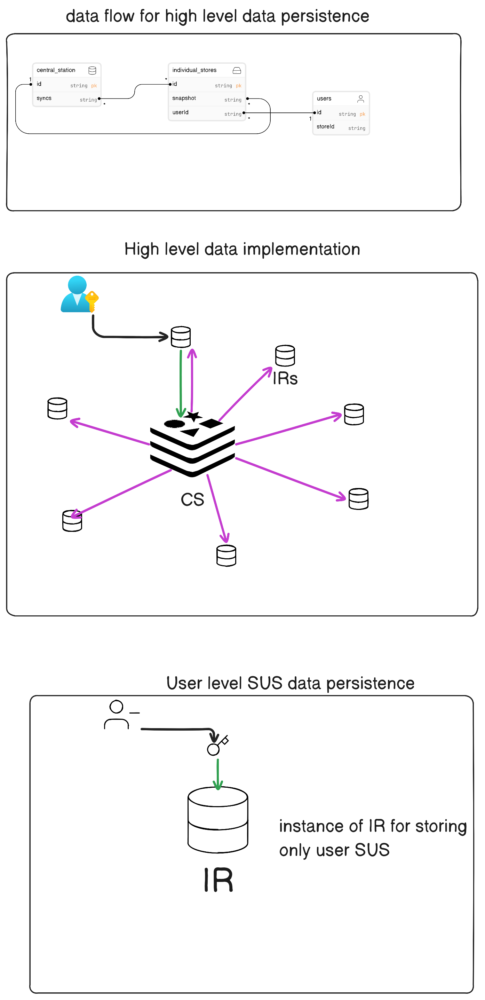

# susdb

SusDB is a secure user string database system designed to manage and protect sensitive user data. This wiki serves as a guide to understanding SusDB's architecture, features, data security, and the post office metaphor that helps illustrate its functions.

## Table of Contents

- [Introduction](#introduction)
- [Features](#features)
- [Architecture](#architecture)
- [Data Security](#data-security)
- [Account Recovery](#account-recovery)
- [The Classical Post Office Story](#the-classical-post-office-story)

## Introduction

SusDB is a secure and efficient database system built to manage sensitive user data. It focuses on securing user strings and enables data recovery when needed. It operates using a post office metaphor, where each user has a secured "box" to store their sensitive data.

For a detailed overview of SusDB, visit the [Introduction](https://github.com/Terre8055/sus-db/wiki) page.

## Features

SusDB boasts a set of essential features that ensure data privacy and security. These features include hashing user strings, integrity checks, data serialization, and account recovery management. Understanding these features is crucial for utilizing SusDB effectively.

Explore the full list of features on the [Features](https://github.com/Terre8055/sus-db/wiki/sus%E2%80%90db:-Secured-User-Strings-Database) page.

## Architecture

The architecture of SusDB revolves around securely storing user data and ensuring its integrity. The system uses a unique file-based approach for database management and a central repository (Redis) for critical resources. Learn how SusDB operates to protect user data.

Check out the [Architecture](https://github.com/Terre8055/sus-db/wiki/Data-Persistency-Architecture) page for a comprehensive understanding.

## Data Security

Data security is a top priority for SusDB. It relies on the Argon2 hashing algorithm to safeguard user strings, ensuring that sensitive information remains confidential. Frequent maintenance and backup procedures are in place to protect against data loss and corruption.

Visit the [Data Security](https://github.com/Terre8055/sus-db/wiki/Data-Security-and-Account-Recovery) page for a deep dive into how SusDB prioritizes your data's safety.

## Account Recovery

SusDB includes an account recovery system to assist users in regaining access to their data if they forget their user strings. This process involves verifying user identity and integrity checks to protect sensitive information.

Learn more about the account recovery process in the [Account Recovery](https://github.com/Terre8055/sus-db/wiki/Data-Security-and-Account-Recovery) section.

## The Classical Post Office Story

To help understand SusDB's operations, we've drawn a metaphor with a classical post office. Just like a post office assigns secure boxes and manages keys, SusDB uses file IDs to protect user data. Redis serves as a central repository, but it doesn't store data directly. This metaphor highlights SusDB's unique approach to data management.

Read the [Classical Post Office Story](https://github.com/Terre8055/sus-db/wiki/The-Classical-Post-Office-Story:-A-Metaphor-for-SusDB) for a creative perspective on SusDB's functions.

## Conclusion

SusDB is designed to secure and manage sensitive user data efficiently. Its unique architecture and security features make it an ideal choice for applications that require privacy and data protection. Explore the wiki to learn how to utilize SusDB effectively and ensure the security of your user data.

Find docs here [SUS-DB Documentation](https://github.com/Terre8055/sus-db/wiki)

